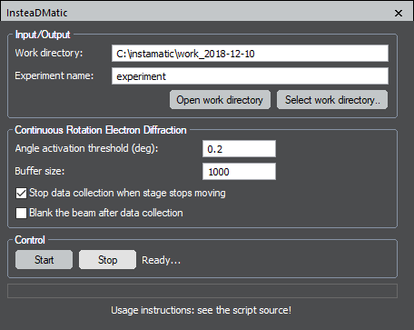

### insteaDMatic v0.2.0: a DM-Script to collect continuous rotation electron diffraction data

Author: Stef Smeets (2018)  
URL: www.github.com/stefsmeets/instamatic

This script helps with automatic data collection of continuous rotation electron diffraction (cRED) data using DigitalMicrograph. It synchronizes with the 'live view' of the camera, and is therefore independent of the type of camera used. Everytime the frame is updated, the data are copied. The script will wait with data collection until rotation has started, and it will stop data collection when rotation stops. The experiment meta-data and diffraction patterns are automatically saved in a new directory, making it convenient for high-throughput data collection.

The script has been tested succesfully on a Thermo Fisher Themis Z with OneView camera and a JEOL JEM-2100 with an Orius camera.

Thanks to Bin Wang and Maria Roslova for helping with the testing, and Thomas Thersleff for discussions about DM and the idea of using the image clone function.
The script is loosely based on an example by Dave Mitchell (http://www.dmscripting.com/example_running_a_thread_from_within_a_dialog.html)

#### How it works:

It uses the 'live view' of the camera as a source of data. Every time the frame is updated, DM fires off an event. 
This scripts waits for this event and then clones the image. These data are equivalent to what can be obtained using the 'Record' function.
Therefore, the settings of the image collection (exposure, resolution, binsize, etc.) are controlled through the right-side panel in DM, outside the script.

The script allocates the memory for storing the images beforehand (defined by `buffer size`), and therefore sets the maximum number of frames that can be collected.
Data collection is interrupted when the buffer is full.

When `<Start>` is pressed, the script will wait for rotation to start. When rotation passes the `angle activation threshold` (0.2 degrees), data collection is initiated.
The rotation is controlled through an external script or by using the microscope tilt control.

Press `<Stop>` to interrupt data collection. It is also possible to interrupt the data collection automatically if the sample stops moving. This is done by enabling the checkbox. The script will check the current angle every `0.3` seconds (tuneable), and will interrupt the data collection if the difference equals `0`. After data collection is finished, the beam can be blanked automatically by checking the box.

The work directory and experiment name define where the data are saved. The experiment number is updated automatically so that data are never overwritten.

Make sure to set up the rotation axis (defined as the angle between the horizontal and the position of the rotation axis). The variable is defined as `calibrated_rotation_angle` at the top of the script. It can be calculated using PETS.

Use `instamatic/scripts/process_dm.py` to convert the data to formats compatible with XDS/DIALS/REDp/PETS
(www.github.com/stefsmeets/instamatic)

#### Usage instructions:
1. Insert the camera in view mode (for Oneview, use 'In-situ Acquisition')
   - Set the exposure (i.e. 0.3 s) and press 'View'
   - For Oneview, set the diffraction mode for the acquisition (Click 'D')
   - Set the binsize and other processing parameters
2. Set the buffer size to the maximum number of frames to be collected (i.e. 1000)
3. Press `<Start>` to prime the script for data collection
   - The script will wait until rotation is initiated, and then start acquiring data
4. Press `<Stop>` to stop the data acquisition
   - Data acquisition will end  if the frame buffer is full
   - Data acquisition will end if the stage stops rotating (if set)
5. Data are stored to the `<work_directory>/<sample_directory>_#`
   - Experiment meta data are stored in the `cRED_log.txt` file
   - Images are stored in `.tiff` format in the `tiff` subdirectory
   - use `python instamatic/scripts/process_dm.py cRED_log.txt` to for data conversion

#### FEI only:
If you are running on a FEI machine, you can control the rotation directly from the dmscript
To do so, instamatic should be installed on the microscope computer. The communication is done through a utility called netcat (available from (available from https://joncraton.org/blog/46/netcat-for-windows/))

- Set the `use_temserver` toggle to `true` in the script
- Make sure you have run `instamatic.temserver_fei` on the microscope computer
- Set the location of software NETCAT on the camera PC (the one running DM) in the variable `netcat_path`
- Give the IP address and port for TEM Python server in the variable `server_host_address`
- Fill in the desired rotation angle and speed

