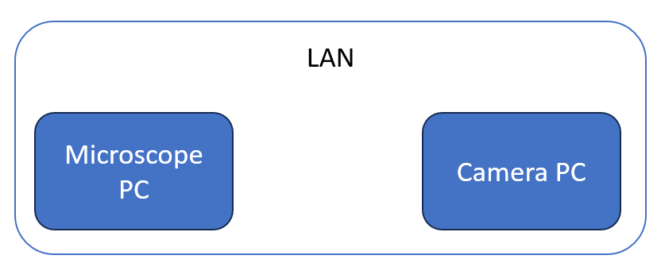
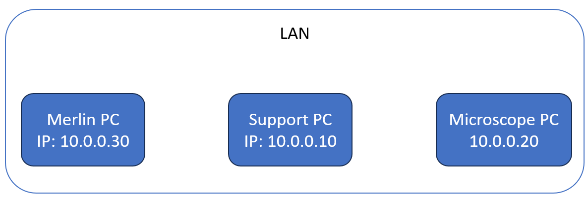
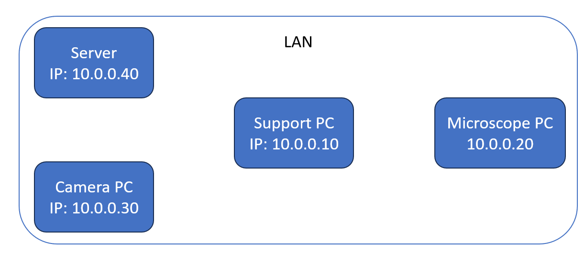

# Local network

Every microscope and camera setup appears to be somewhat different. For example, the microscope can be controlled one PC, but the camera only through another. Instamatic was developed with this limitation in mind and can talk to itself over a local area network (LAN). As long as the PCs are connected to one another via IP, instamatic can communicate and retrieve data from the microscope PC, camera PC, or both.

Note that JEOL has its TEMCOM library, which also has this functionality. If this is available on the PC you are running instamatic on, use that instead.

In each case, the camera control software, `instamatic.temserver` and/or `instamatic.camserver` must be started before starting the main instamatic instance.

This page shows some example configurations.

## Example 1

This example shows a case where you want to install instamatic on the camera PC.

1. Run `instamatic.temserver` first on the microscope PC
2. Run instamatic on the Camera PC



### Configuration

On the microscope PC:

```yaml title="settings.yaml"
use_tem_server: True
cam_server_host: 10.0.0.20
cam_server_port: 8088
```

On the camera PC:

```yaml title="settings.yaml"
use_tem_server: True
cam_server_host: 10.0.0.12
cam_server_port: 8088

use_cam_server: False
```


## Example 2

This is an example where the microscope and camera PCs should be controlled through an intermediate support PC.

If your camera can be controlled directly through TCP/IP, such as the MerlinEM or ASI Cheetah (via `serval`), do not use `instamatic.camserver`, but connect directly to the IP. For example, for Merlin.

1. Start Merlin software first
2. Run `instamatic.temserver` on the Microscope PC
3. Run instamatic on the Support PC



### Configuration

On the support PC:

```yaml title="settings.yaml"
use_tem_server: True
tem_server_host: 10.0.0.20
tem_server_port: 8088
```

```yaml title="camera/merlin.yaml"
host: 10.0.0.30
```

On the Microscope PC:

```yaml title="settings.yaml"
cam_server_host: 0.0.0.0
cam_server_port: 8088
cam_use_shared_memory: False
```

## Example 3

If your camera cannot be controlled through TCP/IP, you might try this solution. This seems to be a common setup for TFS/FEI microscopes.

1. Run `instamatic.camserver` on the Camera PC
2. Run `instamatic.temserver` on the Microscope PC
3. Run instamatic on the Support PC



### Configuration

On the support PC:

```yaml title="settings.yaml"
use_tem_server: True
tem_server_host: 10.0.0.20
tem_server_port: 8088

use_cam_server: True
cam_server_host: 10.0.0.30
cam_server_port: 8087
cam_use_shared_memory: False
```

On the Camera PC:

```yaml title="settings.yaml"
cam_server_host: 0.0.0.0
cam_server_port: 8087
cam_use_shared_memory: False
```

On the Microscope PC:

```yaml title="settings.yaml"
use_tem_server: True
tem_server_host: 10.0.0.20
tem_server_port: 8088
```
